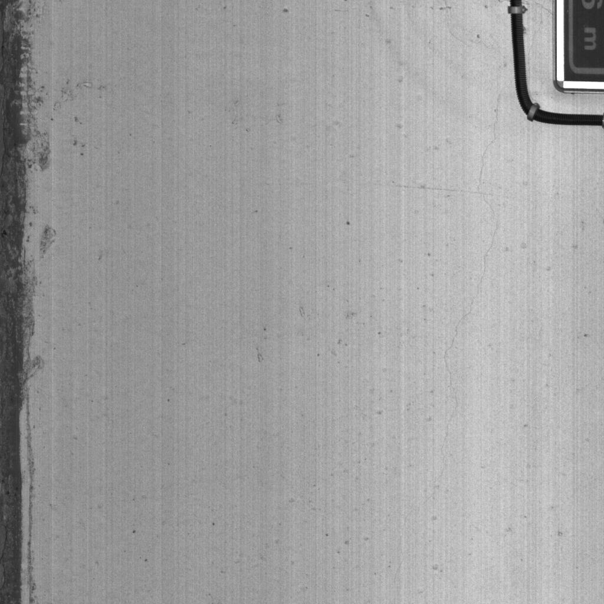
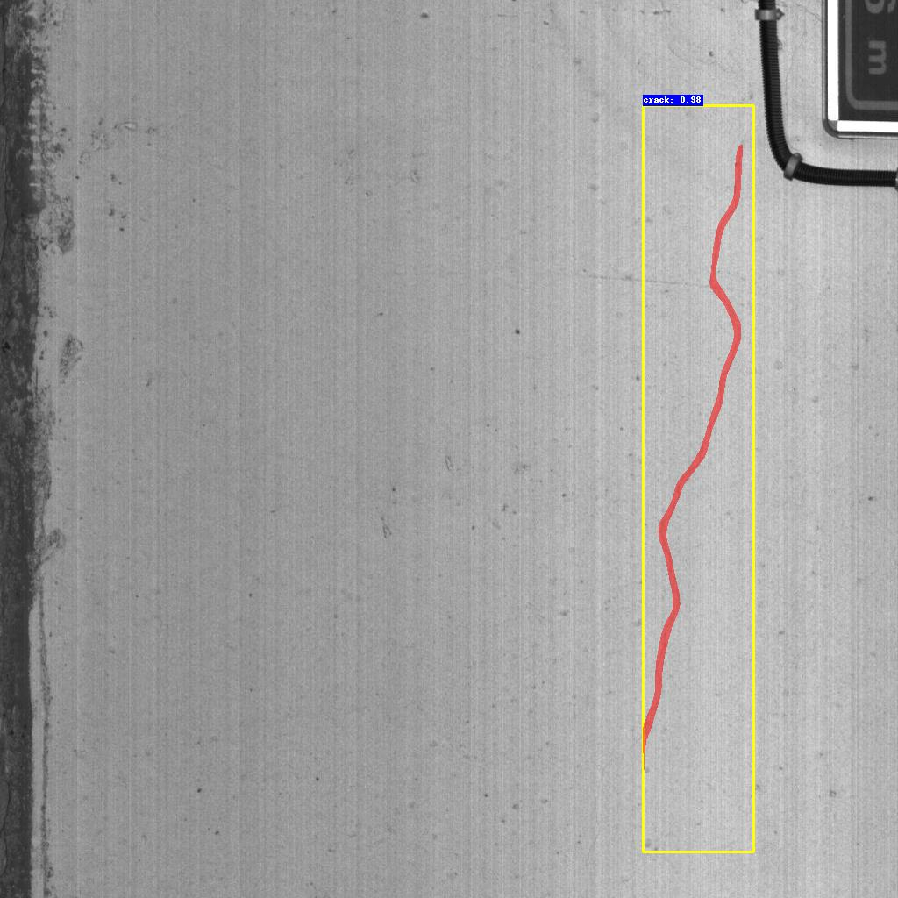
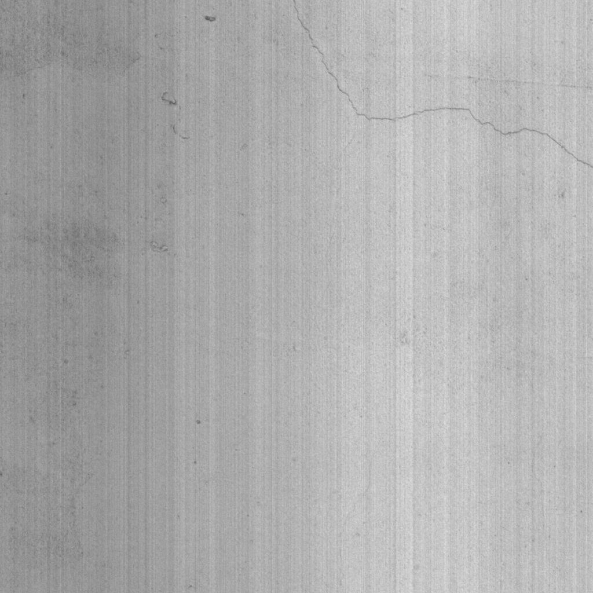
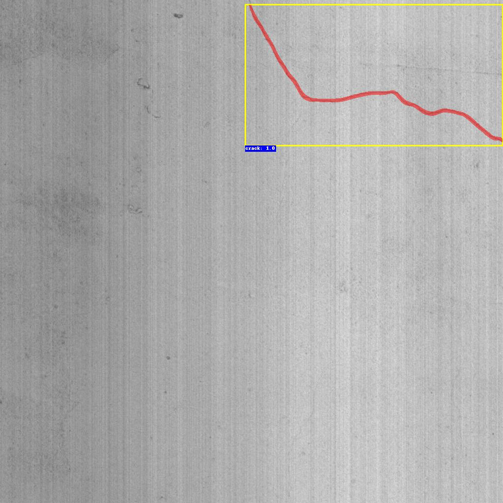

# Improve accuracy during testing for crack segmentation with the Optimal Threshold Module

A Pytorch implementation of OTM on Mask R-CNN for crack instance segmentation

## 1. Installation

We provide an user-friendly configuring method via [Conda](https://docs.conda.io/en/latest/) system, and you can create a new Conda environment using the command:

```
conda env create -f environment.yml
```


## 2. Pretrained Models

Pretrained models on PyTorch are available at,

[Baidu Yun](https://pan.baidu.com/s/1ZxzhWEvcXf03aHVAqpw5Xg?pwd=oydm)
passcode: oydm


## 3. Dataset Format

This project uses the COCO dataset format and the data should be organized as follows

```
data_root/
├── images
│   ├── xxx.png
│   ├── xxy.png
│   └── ...
└── annotations
	├── train_coco_anns.json
	└── test_coco_anns.json

```

## 4. Dataset

We provide the `COCO annotation` file of the crack500 dataset for instance segmentation.

Our coco annotation files can download from the following link,

[Baidu Yun](https://pan.baidu.com/s/1TqDhRMw20VQeeMi-vHgxaA?pwd=mm5i)
passcode：mm5i

Due to confidentiality, image data can be downloaded from the links provided in their corresponding papers.

## 5. Train Mask R-CNN with OTM from scratch

Before you start training, please format the data to the above data format and set the dataloader correctly according to the script under the dataset dictionary.

Please [download](https://download.pytorch.org/models/resnet50-0676ba61.pth) the resnet50 weights file and name it `./resnet50.pth`.

- First train a Mask R-CNN model without OTM


```
python train.py --data-path "data_root_path" 
```
After training, select the appropriate weight file **model_x.pth** in the `./save_weights/` directory

- Second obtain the labels of OTM
You need to run the following two scripts to get the **.csv** file for the OTM
```
python obtain_otm_label.py --data-path "data_root_path" --weights-path "model_x.pth" --save_pkl "othrs/labels_otm.pkl"
```

```
python parse_best_othr.py --pkl_path "othrs/labels_otm.pkl" --save_path "othrs/otm_labels.csv"
```
- Final train Mask R-CNN with OTM

```
python train.py --data-path "data_root_path"  --OTM "True" --othrs "othrs/otm_labels.csv"
```
The files in the directory `./save_weights` are the Mask R-CNN with OTM weights after the training is completed.


## 6. Test

The test data format is still COCO format, please adapt it according to the corresponding file in the dataset directory

```
python test.py --data-path "data_root_path" --weights-path "weight-path" --dataset "CrackTunnel1K" 
```
We provide the test results of CrackTunnel1K.
| Method           | mAP50 | MUCov | MWCov |
| ---------------- | ----- | ----- | ----- |
| Mask R-CNN       | 6.5   | 39.6  | 40    |
| Mask R-CNN + OTM | 13    | 45.4  | 46.9  |

Please refer to the paper for more dataset test results and the meaning of the evaluation metrics.

## 7. Predicted Results Visualization

Script *predict.py* provide  predicted visualization for a single image 

```
python predict.py --weight_path "weight_path" --img_path "img_path" 
```
The visualization results will be saved in the `. /results` directory

## 8. Some toy_images

Some toy_images can be found in dictionary `./toy_images`

And the predicted results can be found in dictionary `./results`

| Image | Prediction |
| ----- | ---------- |
|       |            |
|       |            |


## Copy Right

This dataset was collected for academic research.

## Contact

For any problem about this dataset or codes, please contact Dr. Qin Lei (qinlei@cqu.edu.cn)

